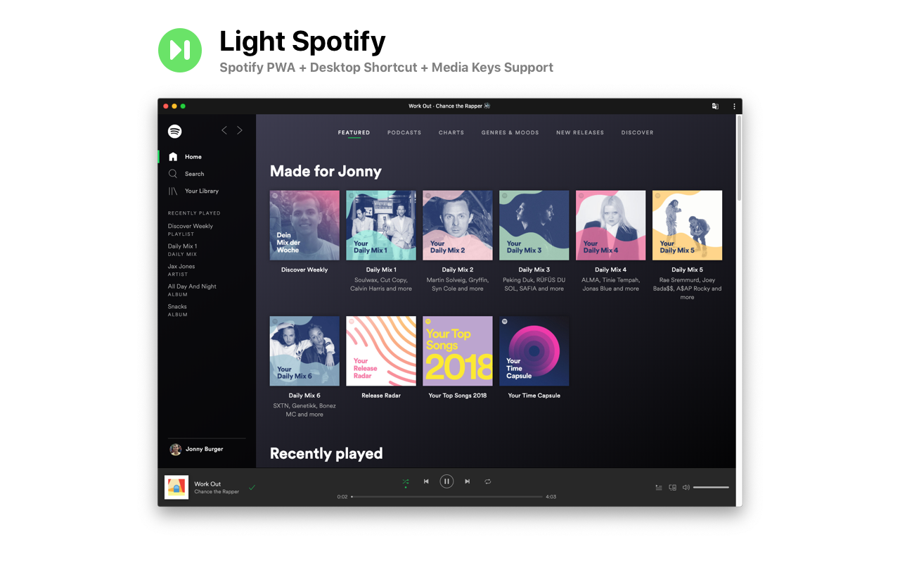
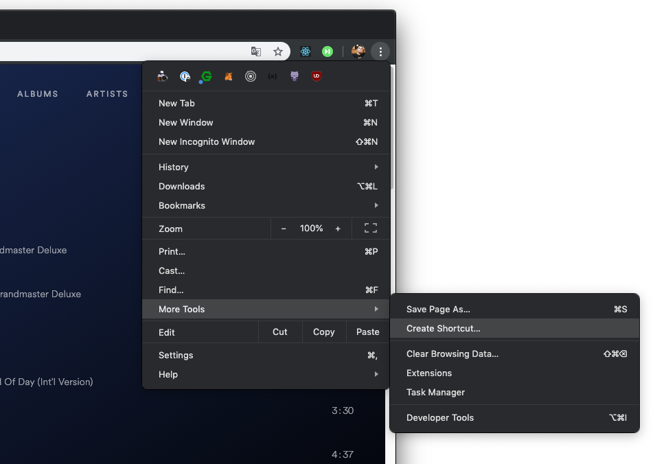
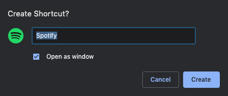
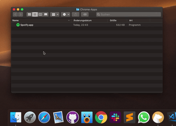
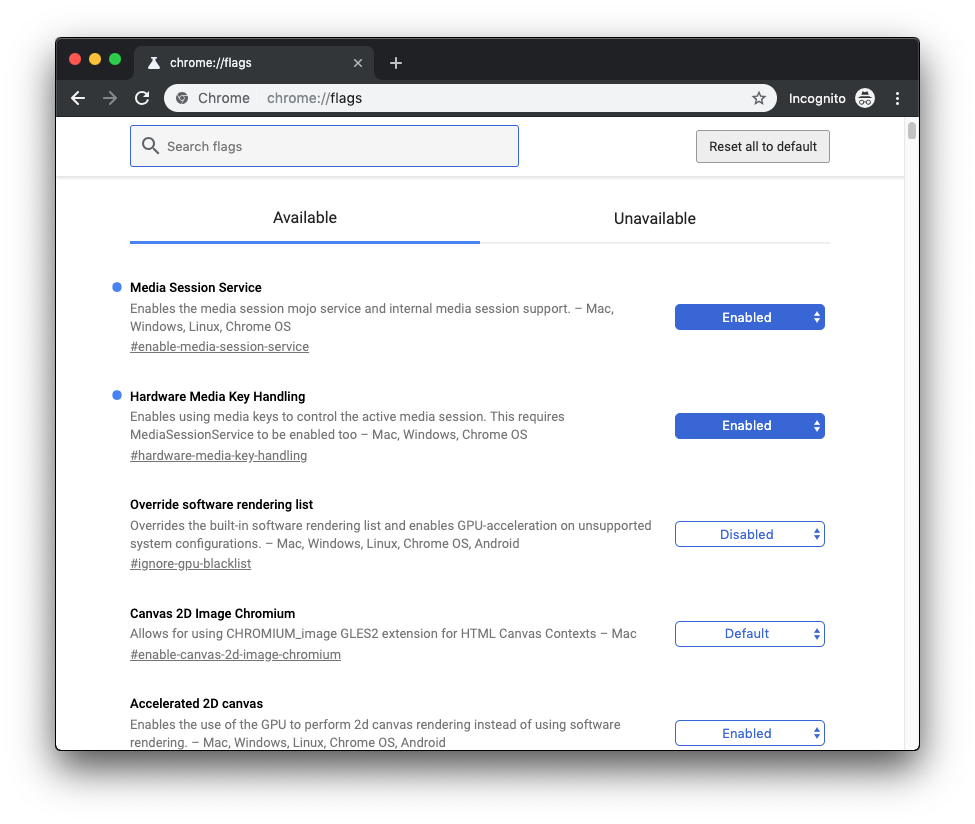

<div style="width: 600px" align="center">



</div>


* More minimalistic, snappier version of Spotify
* Put in your tray and use your ⏪ ⏯ ⏩ buttons as your normal


<hr/>


* Go to [https://open.spotify.com](https://open.spotify.com) to open the Spotify web player.
* Click the Chrome Menu, Select <kbd>More Tools</kbd> and then <kbd>Create Shortcut...</kbd>.



* Check the <input type="checkbox" checked> `Open as window` box and click <kbd>Create</kbd>.




Drag the Spotify app to your tray for fast access.

<p align="center">

</p>


* Make sure you are running at least version 73 of Google Chrome
* Type the following in your address bar and press enter:
```
chrome://flags
```
* Make sure to enable the following options: __#enable-media-session-service__ and __#hardware-media-key-handling__



* Install the extension [__Media Keys for Spotify__](https://chrome.google.com/webstore/detail/media-keys-for-spotify-%E2%8F%AF/jndpdofaejbhcfpadmgcciohlnfokfil):

<p align="center">
<a href="https://chrome.google.com/webstore/detail/media-keys-for-spotify-%E2%8F%AF/jndpdofaejbhcfpadmgcciohlnfokfil" target="_blank">
<br/>
  
  <br/>
</a>
</p>


* Reload all Spotify pages.
* Enjoy a faster Spotify!
<br/>

This repository contains the code for this extension. Issues and pull requests are welcome.

## Credits

<p align="center">
<sup>Tutorial and Chrome extension by</sup><br/>
<p align="center">
<a href="https://twitter.com/JNYBGR">

</a>
</p>
</p>
